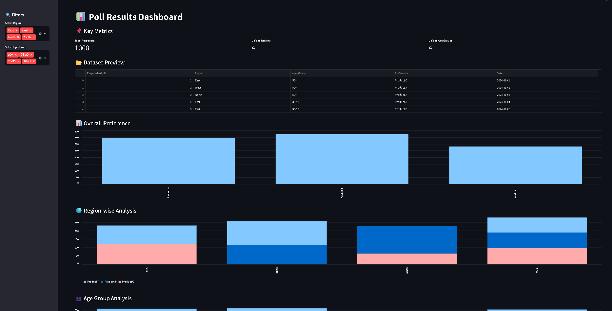
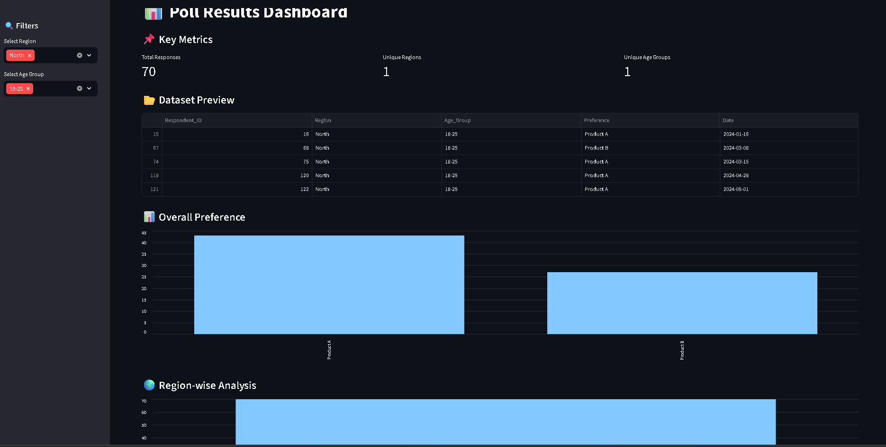
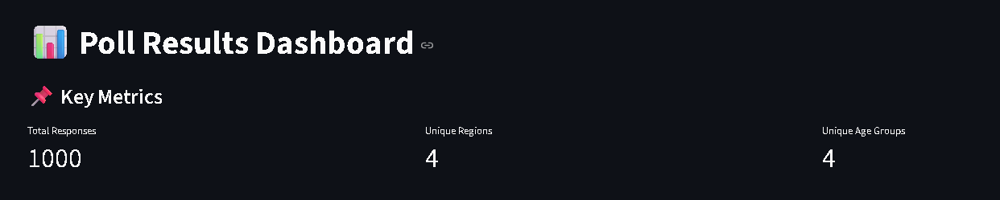
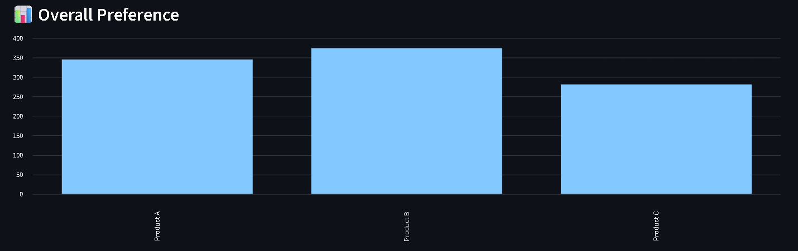
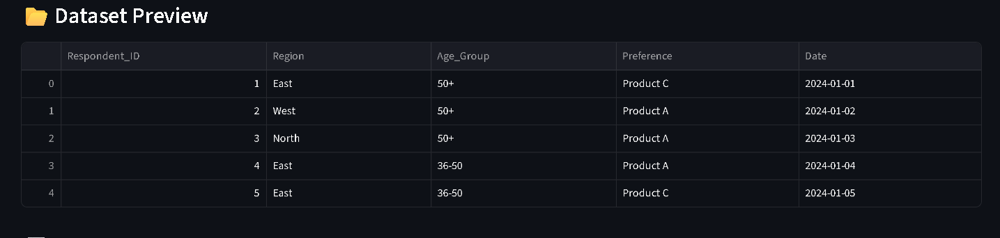
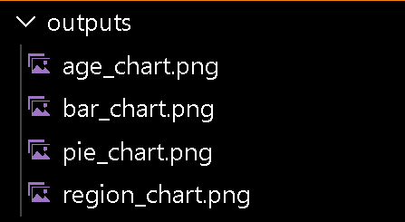

# 📊 Poll Results Visualizer Dashboard

🚀 A complete **end-to-end Data Analytics project** that processes, analyzes, and visualizes poll/survey data using Python and an interactive Streamlit dashboard.

---

## 🌐 Live Demo

👉 https://poll-results-visualizer-rrd77mb6ytuwkw3vnbnbz9.streamlit.app

---

## 📂 GitHub Repository

👉 https://github.com/Vayu-143/Poll-Results-Visualizer

---

## 🎯 Problem Statement

Organizations collect large amounts of survey and poll data but struggle to:

* Extract meaningful insights
* Analyze trends across demographics
* Visualize results effectively

---

## 💡 Solution

This project provides a **Poll Results Visualizer** that:

* Cleans and processes raw survey data
* Performs aggregation and percentage analysis
* Generates visual insights using charts
* Provides an **interactive dashboard** for real-time exploration

---

## 🧠 Workflow

```text
Data Generation → Data Cleaning → Analysis → Visualization → Dashboard → Insights
```

---

## 🛠️ Tech Stack

* **Python**
* **Pandas**
* **NumPy**
* **Matplotlib**
* **Seaborn**
* **Streamlit**

---

## ⚙️ Features

✅ Synthetic poll data generation
✅ Data cleaning and preprocessing
✅ Vote share and percentage analysis
✅ Region-wise and demographic insights

### 📊 Visualizations:

* Bar chart
* Pie chart
* Stacked charts

✅ Interactive Streamlit dashboard
✅ Filters (Region, Age Group)
✅ KPI metrics:

* Total responses
* Unique regions
* Age groups

---

## 📊 Dashboard Preview

### 📌 Main Dashboard



### 🔍 Filters Applied



### 📌 Key Metrics



---

## 📈 Visualizations

### 📊 Bar Chart



---

## 📂 Dataset Preview



---

## 📁 Output Charts



---

## 📊 Sample Insights

* 🏆 Product B is the most preferred product
* ❌ Product C is the least preferred product
* 🌍 Regional preferences vary significantly
* 👥 Age groups show different behavior patterns

---

## 💼 Real-World Use Cases

* Election poll analysis
* Customer feedback analysis
* Product preference studies
* Employee satisfaction surveys
* Market research

---

## 📁 Project Structure

```bash
Poll-Results-Visualizer/
│
├── data/
│   └── poll_data.csv
│
├── src/
│   ├── data_generator.py
│   ├── data_cleaning.py
│   ├── analysis.py
│   ├── visualization.py
│   ├── insights.py
│
├── outputs/
│   ├── bar_chart.png
│   ├── pie_chart.png
│   ├── region_chart.png
│   └── age_chart.png
│
├── app/
│   └── dashboard.py
│
├── notebooks/
│   └── eda.ipynb
│
├── images/
│   ├── dashboard_full.png
│   ├── dashboard_filtered.png
│   ├── metrics.png
│   ├── bar_chart_dashboard.png
│   ├── dataset_preview.png
│   ├── outputs_folder.png
│
├── main.py
├── requirements.txt
└── README.md
```

=======

---

## ▶️ How to Run the Project Locally

### 1️⃣ Clone Repository

```bash

git clone https://github.com/Vayu-143/Poll-Results-Visualizer.git
cd Poll-Results-Visualizer

```

---

### 2️⃣ Create Virtual Environment

```bash
python -m venv venv
venv\Scripts\activate   # Windows
```

---

### 3️⃣ Install Dependencies

```bash
pip install -r requirements.txt
```

---

### 4️⃣ Run Data Pipeline

```bash
python main.py
```

---

### 5️⃣ Run Dashboard

```bash
streamlit run app/dashboard.py
```

---

## 🎤 Interview Explanation

> “I built an end-to-end Poll Results Visualizer where I generated and cleaned survey data, performed analysis using Pandas, created visualizations, and developed an interactive Streamlit dashboard with filters and KPIs for real-time insights.”

---

## 📌 Key Learnings

* Data cleaning and preprocessing
* Exploratory Data Analysis (EDA)
* Data visualization techniques
* Dashboard development with Streamlit
* End-to-end analytics workflow

---

## 🚀 Future Improvements

* 🔥 Real-time data integration (Google Forms/API)
* 🔥 SQL database integration
* 🔥 Power BI dashboard version
* 🔥 Sentiment analysis on open-ended responses
* 🔥 Machine learning for predictions

---

## 👨‍💻 Author

Vayunandan Mishra

---

## 🌟 Support

If you found this project useful, please ⭐ star the repository!
